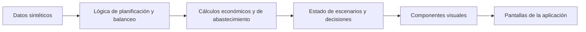

# Arquitectura

Este documento describe cómo está organizado el código de OptiFlow Industrial y cómo fluyen los datos entre sus capas. Para el detalle de fórmulas y supuestos de negocio, ver [`V1.1/DATA_ASSUMPTIONS.md`](./V1.1/DATA_ASSUMPTIONS.md); para las entidades del dominio, ver [`DATA_MODEL.md`](./DATA_MODEL.md).

La aplicación vive en `V1/` (carpeta configurada como Root Directory en Vercel). Todas las rutas de este documento son relativas a `V1/src/`.

---

## Flujo de datos

1. **Datos sintéticos** (`lib/data/`): parámetros del caso —productos, líneas, materias primas, proveedores, órdenes de compra— y su generación determinista.
2. **Lógica de planificación y balanceo** (`lib/planning/`, `lib/balance/`): a partir de un escenario, construyen un plan de producción o una asignación de tareas a estaciones.
3. **Cálculos económicos y de abastecimiento** (`lib/planning/evaluate.ts`, `lib/supply/`): valorizan el plan (costos, nivel de servicio) y calculan cobertura, punto de pedido, riesgo y recomendaciones de compra.
4. **Estado de escenarios y decisiones** (`state/`): hooks de React que mantienen el escenario activo de cada módulo y, en abastecimiento, las decisiones de aprobación humana.
5. **Componentes visuales** (`components/`): tablas, gráficos (Recharts) y elementos de interfaz que consumen ese estado.
6. **Pantallas** (`app/`): rutas del App Router de Next.js que ensamblan estado y componentes en cada página.

Cada paso es una función pura sobre el anterior: dado el mismo escenario, el resultado es siempre idéntico. No hay llamadas a servicios externos ni fuentes de aleatoriedad en tiempo de ejecución.

---

## Capas del sistema

### 1. Datos (`lib/data/`)

Contiene únicamente constantes de negocio y su ensamblado en un dataset:

- `config.ts`: familias de producto, líneas, velocidades, matriz de setups, semillas de productos, proveedores y materias primas del planificador semanal.
- `generate.ts` / `dataset.ts`: generador determinista (semilla fija) que produce el dataset completo del planificador —demanda histórica, stock inicial, costos— una sola vez por proceso.
- `line-config.ts` / `assembly-line.ts`: caso independiente del balanceo de línea (tareas, precedencias, turnos); `assembly-line.ts` valida en tiempo de build que el grafo de precedencias no tenga ciclos.
- `supply-config.ts` / `supply-catalog.ts`: amplían el caso del planificador semanal con materias primas, proveedores, lista de materiales y órdenes de compra para la Torre de abastecimiento, sin modificar los datos originales de `config.ts`.

Ningún componente ni página lee constantes de negocio directamente: siempre pasan por la capa de lógica.

### 2. Tipos (`lib/types.ts`)

Modelo de dominio único, compartido por planificación, balanceo y abastecimiento: productos, líneas, materiales, proveedores, escenarios, resultados de evaluación y recomendaciones.

### 3. Lógica de negocio

- **`lib/planning/`**: contexto de planificación (`context.ts`), plan base (`baseline.ts`), plan heurístico recomendado (`heuristic.ts`), evaluación económica y comparación (`evaluate.ts`), alertas y resumen de decisiones (`insights.ts`). `index.ts` orquesta el ciclo completo mediante `runPlanning(escenario)`.
- **`lib/balance/`**: mismo patrón para el balanceo de línea. `metrics.ts` calcula takt time, capacidad y eficiencia; `heuristic.ts` implementa la asignación por peso posicional (RPW); `index.ts` expone `runBalance(escenario)`.
- **`lib/supply/`**: contexto de abastecimiento (`context.ts`), fórmulas de cobertura y riesgo (`metrics.ts`), motor de recomendaciones de compra (`recommendations.ts`); `index.ts` expone `runSupply(escenario)`.

Los tres puntos de entrada (`runPlanning`, `runBalance`, `runSupply`) son funciones puras y cacheadas: reciben un escenario normalizado y devuelven siempre el mismo resultado.

### 4. Estado de escenarios y decisiones (`state/`)

Hooks de React (`useScenario`, `useBalanceScenario`, `useSupplyScenario`) que mantienen el escenario activo de cada módulo en memoria y disparan el recálculo correspondiente. `use-supply-decisions.ts` es la única pieza de estado que persiste entre sesiones: guarda las decisiones de aprobación de compra en el `localStorage` del navegador.

### 5. Componentes visuales (`components/`)

Organizados por módulo (`dashboard/`, `plan/`, `inventory/`, `balance/`, `supply/`) más un conjunto de primitivas de interfaz compartidas (`ui/`) y gráficos con paleta común (`charts/`). No contienen lógica de cálculo: reciben datos ya procesados por la capa de lógica.

### 6. Páginas (`app/`)

Cada ruta del App Router corresponde a una pantalla (`/`, `/plan`, `/inventario`, `/balanceo`, `/torre`, `/simulador`, `/metodologia`) y combina un hook de estado con los componentes de su módulo.

### 7. Validaciones (`scripts/verify.ts`)

Script ejecutado con `npm run verify` que recalcula los presets y escenarios extremos de los tres módulos, imprime sus indicadores y comprueba: reproducibilidad entre corridas idénticas, coherencia estructural del caso de abastecimiento (materiales, proveedores y órdenes referenciados existen) y ausencia de divisiones por cero en el cálculo de cobertura.

---

## Por qué el abastecimiento mantiene su propio escenario

La Torre de abastecimiento reutiliza la demanda del planificador semanal (mismo pronóstico base), pero mantiene su **propio estado de escenario**, independiente del simulador global. Las variables del simulador de planificación (capacidad de línea, tiempos de setup, multiplicador de faltante de producto terminado) no intervienen en una decisión de compra; acoplar ambos escenarios habría hecho que mover un control de compras alterara, sin necesidad, el plan de producción.
