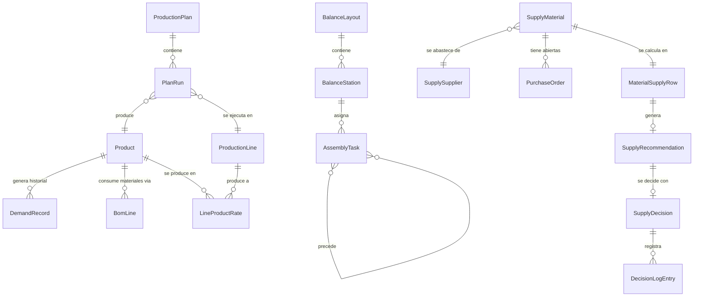

# Modelo de datos

Entidades principales del dominio de OptiFlow Industrial, definidas en `V1/src/lib/types.ts`. Este documento resume qué representa cada entidad y cómo se relacionan; para las fórmulas que operan sobre ellas, ver [`V1.1/DATA_ASSUMPTIONS.md`](./V1.1/DATA_ASSUMPTIONS.md).

---

## Planificación de producción

**`Product`** — Un SKU terminado: familia (`FamilyId`), costo unitario, margen de contribución, penalidad por faltante, costo de mantener inventario, stock inicial, días de stock de seguridad, línea preferida y líneas alternativas.

**`DemandRecord`** — Un registro histórico de demanda: producto, día y unidades vendidas ese día. La serie histórica alimenta el pronóstico del horizonte de planificación.

**`ProductionLine`** — Una línea de producción: turnos por día, minutos productivos, minutos máximos de hora extra, costo de hora extra, costo de setup y familias que puede fabricar.

**`LineProductRate`** — Velocidad de producción (unidades por minuto) de un producto en una línea determinada.

**`SetupTimeEntry`** — Minutos de cambio de formato al pasar de una familia a otra, por línea.

**`ProductionPlan`** — El resultado de programar: una lista de `PlanRun` (una corrida = producto, línea, día, unidades y la razón por la que se programó) agrupadas en `PlanLineDay` (carga y setups por línea y día).

**`PlanEvaluation`** — La valorización económica de un `ProductionPlan`: costos (`CostBreakdown`: setup, horas extra, inventario, faltante), nivel de servicio, utilización y resultados diarios por producto (`ProductDayResult`) y por línea (`LineResult`).

**`PlanComparison`** — La diferencia entre el plan base y el plan recomendado: delta de costo, de nivel de servicio, de setups y de horas extra.

**`OperationalAlert`** — Una alerta operativa generada a partir de la evaluación del plan (faltante, cobertura baja, exceso de inventario, saturación de línea), con su severidad y el impacto económico estimado.

---

## Balanceo de línea

**`AssemblyTask`** — Una tarea del proceso de ensamble: etapa (`StageId`), tiempo estándar en segundos, tareas predecesoras y estación de la asignación inicial (sin balancear).

**`AssemblyLineCase`** — El caso completo: sus tareas, etapas, demanda diaria base, minutos de turno y costos de estación y de unidad no atendida.

**`BalanceStation`** — Una estación de trabajo con las tareas que tiene asignadas, su carga total, su ociosidad y si es el cuello de botella de la línea.

**`BalanceLayout`** — Una distribución completa de tareas en estaciones (inicial o recomendada), con sus métricas (`BalanceMetrics`: takt time, tiempo de ciclo, eficiencia, pérdida por desbalance) y su costo (`BalanceCost`).

**`BalanceComparison`** — La diferencia entre la distribución inicial y el balance recomendado: delta de eficiencia, de tiempo de ciclo, de capacidad y de costo.

---

## Abastecimiento (Torre de abastecimiento)

**`SupplyMaterial`** — Una materia prima: código, categoría (`MaterialCategory`: producto base, aditivo, envase, cierre, etiqueta, embalaje), unidad de medida, stock disponible, días de stock de seguridad, costo unitario, criticidad y proveedor principal.

**`BomLine`** *(planificación)* / lista de materiales del catálogo de abastecimiento — Relaciona un producto terminado con una materia prima y la cantidad que consume por unidad producida. Es la base para traducir demanda en consumo de materia prima.

**`SupplySupplier`** — Un proveedor: lead time promedio y máximo, confiabilidad de entrega, cantidad mínima de compra, factor de precio sobre el costo del material, condición de pago y nivel de riesgo asociado.

**`PurchaseOrder`** — Una orden de compra abierta: proveedor, material, cantidad, fecha de emisión, fecha prometida, fecha estimada de llegada y estado (`PurchaseOrderStatus`: en tránsito, retrasada, confirmada o pendiente).

**`MaterialSupplyRow`** — El resultado del cálculo de abastecimiento para un material en un escenario dado: consumo proyectado, stock proyectado, cobertura en días, punto de pedido, nivel de riesgo (`SupplyRiskLevel`: crítico, alto, medio, bajo) y la cantidad de compra sugerida.

**`OpenOrderRow`** — Una orden de compra ya evaluada contra el escenario activo: su retraso estimado y si cuenta como abastecimiento firme dentro del horizonte analizado.

**`SupplyRecommendation`** — La recomendación de compra de un material: una única acción principal (`SupplyAction`: comprar de forma urgente, anticipar orden, compra normal, consolidar compra, monitorear o no comprar), su razón explicable, cantidad, proveedor, fecha límite de decisión, costo estimado y nivel de confianza (`SupplyConfidence`).

**`SupplyResult`** — El resultado completo de un escenario de abastecimiento: todas las `MaterialSupplyRow`, las `OpenOrderRow`, las `SupplyRecommendation` y los KPI agregados (`SupplyKpis`).

---

## Decisiones humanas (HITL)

**`SupplyDecision`** — El estado de aprobación de una recomendación: pendiente, aprobada, rechazada o requiere revisión (`DecisionStatus`), con una nota opcional. Es la única entidad que persiste entre sesiones, guardada en el `localStorage` del navegador.

**`DecisionLogEntry`** — Una entrada del registro histórico de decisiones: qué se recomendó, quién decidió, cuándo, qué decisión tomó y el impacto económico estimado en ese momento.

---

## Relaciones entre entidades

